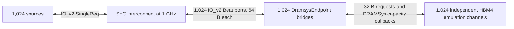

# SoC B16 context sweep with DRAMSys HBM4 channels

These archived measurements use the original **burst-FIFO** endpoint. The
production endpoint now interleaves ready read beats round robin; see the
[diagnosis and production validation](soc_context_b16_hbm4_diagnosis.md).
Rerunning the current model therefore does not reproduce this historical FIFO
table without using the archived endpoint implementation.

All six configurations completed successfully using the real DRAMSys library.
**X=8 has the lowest measured runtime: 71,050.5 cycles
(71.0505 µs), delivering 15.112 TB/s across
1,024 channels.** X=8 is the smallest tested context count within 5% of
the best result. This conclusion applies to this all-to-all, repeated-address workload.

[Exact CSV](soc_context_b16_hbm4_results.csv) ·
[Results and source/configuration hashes](soc_context_b16_hbm4_results.json) ·
[DRAMSys integration checks](hbm4_checks.json) ·
[Archived measurement configuration](hbm4_config/README.md) ·
[Compressed raw simulation logs](hbm4_logs/manifest.json) ·
[Build and dependency details](hbm4_environment.json)

Follow-up: [bandwidth and response-scheduling diagnosis](soc_context_b16_hbm4_diagnosis.md)
compares against simple memory at the same bus width and clock, and measures one
HBM4 endpoint with the NoC bypassed. The low end-to-end rate below does not imply
that an isolated HBM4 endpoint is limited to that rate.

## Configuration and workload

This reproduces the workload and topology of
`3D-Fattree-Impl/docs/soc_context_b16.md`, with the requested bus, clock, memory
and context changes. The original RAM endpoint is replaced by one independent
DRAMSys HBM4 emulation instance per terminal. `SocInterconnect` connects directly
to the new `DramsysEndpoint` through IO_v2 beat ports.



| Setting | Value |
|---|---|
| Fabric / routing | Fat tree / NCA_HASH (0 / 1) |
| Terminals / fat-tree levels | 32 × 32 = 1,024 / 3 |
| NoC and AXI endpoint clock | 1 GHz; 1 ns/cycle |
| AXI address / data / ID / LEN widths | 64 / 512 / 10 / 8 bits |
| Burst length / beat size | 16 / 64 bytes; 1,024 bytes per read |
| Maximum burst capacity | 256 beats |
| SourceContexts = MemoryContexts | 8, 16, 32, 64, 128, 256 |
| Additional memory read-slot limiter | None |
| Memory map / interleaving | Default 4 KiB per terminal / 4 KiB stripes |
| Local start address | 0 |
| DRAMSys source configuration | `hbm4-emu-example.json` |
| DRAM period | User memspec `tCK = 0.25 ns`; `clkMhz = 4000` |
| Pseudochannels per channel | 2 × 32-bit, DDR |
| Peak bandwidth | 64 GB/s per channel; 65.536 TB/s aggregate |
| Page policy / scheduler / buffers | Open / FrFcfs / Bankwise |
| DRAMSys request buffer / maximum active transactions | 512 / 512 (unchanged) |
| Refresh | AllBank; original timings and postpone/pull-in limits retained |
| DRAM storage | Store mode; original mmap allocation (`UseMalloc=false`) |

Each source `s` continuously offers 1,024 reads to `(s+k) % 1024`, for
`k=0…1023`, with the same local address 0 at every destination. Every run checks
**1,048,576 reads, 16,777,216 AXI R beats, and 1,073,741,824 bytes (1 GiB)**.
RREADY stays high. No extra source response stalls are enabled in the sweep.

The benchmark keeps the original 4 KiB mapped region at each endpoint; the
memspec describes 1 GiB of modeled storage per channel. This is a repeated
1 KiB address range in each channel, not a sweep over all HBM rows. Consequently,
the results characterize this benchmark's bank/row locality and should not be
used as a streaming or random-address HBM bandwidth measurement.

## Measurements

Bandwidth counts useful R data, summed over all masters. GB/s and TB/s are
decimal. The per-channel figure is the system mean, including NoC admission,
reservation/grant traffic, memory service, response delivery and final drain.

| X | Runtime (cycles) | Simulated time (µs) | Aggregate TB/s | Mean GB/s/channel | % of 64 GB/s | Simulation wall (s) | Process wall (s) | Peak host RSS (MiB) |
|---:|---:|---:|---:|---:|---:|---:|---:|---:|---:|
| 8 | 71,050.5 | 71.0505 | 15.112 | 14.758 | 23.06% | 314.96 | 317.17 | 251.8 |
| 16 | 71,920.5 | 71.9205 | 14.930 | 14.580 | 22.78% | 340.45 | 342.66 | 382.9 |
| 32 | 72,946.5 | 72.9465 | 14.720 | 14.375 | 22.46% | 407.11 | 409.35 | 623.6 |
| 64 | 73,870.5 | 73.8705 | 14.535 | 14.195 | 22.18% | 992.84 | 995.07 | 911.3 |
| 128 | 75,019.5 | 75.0195 | 14.313 | 13.977 | 21.84% | 1109.03 | 1111.31 | 1461.1 |
| 256 | 77,826.5 | 77.8265 | 13.797 | 13.473 | 21.05% | 1442.41 | 1444.73 | 2724.1 |

Simulation wall time is measured by the benchmark driver from reset release
through final completion. Process wall time additionally includes target
generation, simulator startup, DRAMSys channel construction/preload and shutdown.
It excludes compilation and post-run Python log checks. X=8/16/32 ran sequentially; X=64/128/256 ran
concurrently to shorten the sweep. Each event simulation uses one CPU thread
on an AMD Ryzen 7 5800X host. These are individual wall-time samples on a shared
host, without CPU pinning. Compare cycle counts to assess hardware performance;
the wall times also reflect host load and the concurrency noted here. Peak RSS
comes from `/usr/bin/time -v`.

Runtime uses the original benchmark's half-cycle convention: first offered AR
to final master completion. One cycle now means 1 ns. The formulas are:

```
simulated_us = runtime_cycles / 1000
aggregate_GBps = 1,073,741,824 / runtime_cycles
mean_channel_GBps = aggregate_GBps / 1024
```

64 GB/s is a channel ceiling, not the expected end-to-end rate. Each read
requires a reservation, a grant, an AR packet and 16 R packets. At one injected
packet per terminal per cycle, this gives a topology-independent injection
lower bound of `1024 × 19 = 19,456` cycles. Transferring 1 MiB through each
64 GB/s channel alone takes 16,384 cycles. Both bounds exclude routing
contention, context waits, DRAM latency/refresh and drain; measured runtime
includes those costs.

| X | Request admission (cycles) | Response drain (cycles) | Peak total outstanding | Peak unfinished reads at one endpoint | Endpoint request denials |
|---:|---:|---:|---:|---:|---:|
| 8 | 70,927.5 | 123.0 | 8,192 | 8 | 0 |
| 16 | 71,062.5 | 858.0 | 16,384 | 16 | 0 |
| 32 | 70,644.5 | 2,302.0 | 32,768 | 32 | 0 |
| 64 | 69,920.5 | 3,950.0 | 65,536 | 64 | 0 |
| 128 | 68,469.5 | 6,550.0 | 131,072 | 128 | 0 |
| 256 | 63,685.5 | 14,141.0 | 262,144 | 256 | 0 |

Admission ends at the last source request acceptance; responses also return
during admission. Endpoint peak reads counts accepted bursts whose final R beat
has not yet entered the NoC. It includes buffered completed DRAM data and is
not the DRAM controller's instantaneous native-command queue occupancy.
NI source and memory context limits remain X; only the former RAM read-slot
policy has been removed.
The shared benchmark driver's legacy `readslots` parameter is unused in HBM
mode; neither the NoC nor any `DramsysEndpoint` receives a read-slot setting.

## Memory timing and compatibility

The provided configuration uses `memoryType="HBM2"` to emulate one HBM4 channel.
These results therefore describe **the supplied HBM4 emulation**, not a separately
validated native HBM4 device model. The edited `CCDS=4` and every other supplied
memspec timing are preserved. In particular, timings have not been fitted to
these benchmark results.

The bundled DRAMSys 5 library needs three compatibility conversions. They are
applied only to a generated copy; the user's original files are unchanged:

1. Use basename configuration references because this loader adds the category
   directories itself. Remove standalone `tracesetup` generators because GVSoC
   provides all requests. Strip JSON comments during serialization.
2. Add `clkMhz=4000`, derived from `tCK=2.5e-10` seconds. The bundled loader reads
   `clkMhz` instead of `tCK`.
3. Correct the address map's byte field. The source map has three `BYTE_BIT`
   bits (8-byte words), which the library rejects against 32-bit pseudochannel
   words. The runtime map uses `[0,1]`, shifting every other address bit down
   by one while preserving ordering. The pseudochannel bit becomes bit 5, so
   adjacent 32-byte DRAM bursts select alternating pseudochannels. The resulting
   geometry is 1 GiB per channel, irrespective of the source map's `16Gb` filename.

Database recording, the progress bar and window instrumentation are disabled
in the generated copy. Controller settings, storage, refresh and timing values
remain unchanged. Original and resolved file SHA-256 values are recorded in
the linked manifest, and the actual resolved JSON files are included beside it.

The bandwidth calculation is
`2 pseudochannels × 32 bits × 2 transfers / 0.25 ns / 8 = 64 GB/s`.
Each 1,024-byte AXI burst becomes 32 native 32-byte requests. The bridge honors
DRAMSys's capacity callback between native requests; no configurable
`MemoryReadSlots` cap is inserted. It aggregates returned bytes into 64-byte
IO_v2 responses, limited to one beat per 1 ns cycle, and retains a denied
response until the NI retries it. Native completions use the bundled C ABI's
FIFO order; the bridge buffers response data without an additional queue limit.
The endpoint used for this table also emitted whole bursts in FIFO order,
unlike the RAM endpoint's round-robin R-beat scheduler. The current production
endpoint keeps native completion order but interleaves ready AXI read beats.

## Validation and limits

For every full run, the checker verifies completion count, each returned byte,
source/request identity, response status and absence of duplicate completions.
Each of the 1,024 endpoint reports independently confirms 1,024 accepted reads,
32,768 native DRAM reads, 1,048,576 returned bytes, no writes and no pending
jobs. That is **33,554,432 native DRAM reads per full run**. The generated target
configs are checked for the requested clock, widths, contexts, topology and
absence of a memory read-slot setting on the NoC or HBM endpoints; compressed
copies are included with the logs. Every DRAMSys channel
also reports a theoretical maximum of 64 GB/s. Exact logs and hashes are
referenced in the results JSON.

Nine additional DRAMSys checks passed: masked-write/readback and error handling
at 8/64/128/512/1024-bit AXI widths, B16 on a 2×2 mesh, response stress on an
8×8 mesh, and sensitivity to the DRAM clock and queue capacity. For the 2×2 B16
case, halving the memory clock increases runtime from 129.5 to 185.5 cycles;
reducing the DRAMSys request buffer and maximum active transactions to one
increases it to 147.5 cycles and produces 12 request denials, all retried
successfully. These variants are validation runs only; all six measured cases
use the user's original controller capacities and memory timings.

The existing non-DRAM RAM endpoint also passed a 512-bit masked-write/stall
regression after the target changes. The previously recorded 33 RTL comparisons
remain evidence for the NoC and original RAM configuration. **No matching RTL +
DRAMSys HBM4 run was performed here, so a within-5% cycle-accuracy claim for this
new memory configuration has not been established.** The original report's
roughly five-hour RTL wall times used 64-bit data, 100 MHz and the simple RAM
endpoint. They are not a controlled speedup comparison for these 512-bit,
1 GHz DRAMSys measurements.

## Reproduce

From the `gvsoc` root on `chi/3darch`, with the compatible bundled library
installed in `third_party/DRAMSys` (see [DRAMSys.md](../../../../DRAMSys.md)):

```bash
source sourceme.sh
export SYSTEMC_HOME=/path/to/systemc-2.3.3-built-with-cxx17
export PYTHON=/path/to/python-with-gvsoc-dependencies
bash pulp/pulp/3d_network/tests/hbm4.sh build
"$PYTHON" pulp/pulp/3d_network/tests/hbm4_checks.py
"$PYTHON" pulp/pulp/3d_network/tests/hbm4_sweep.py
"$PYTHON" pulp/pulp/3d_network/tests/report_hbm4.py
```

The focused build uses Release optimization with debug, tracing and assertions
disabled. The SystemC 2.3.3 dependency is required by the repository's prebuilt
`libDRAMSys_Simulator.so`; a different library must match its SystemC ABI.
Use `LD_LIBRARY_PATH` for the library and `DRAMSYS_PATH` for an alternative
prepared configuration, following GVSoC's conventions. The default build
prepares the canonical source configuration under `build/network3d_hbm4`;
the archived `doc/hbm4_config` files are not read by the model or runner.
Set `NETWORK3D_BUILD_DIR` to relocate generated files.
`hbm4_sweep.py --reuse` verifies input hashes and completed logs before reusing them.
See [the model README](../README.md#dramsys-hbm4-endpoints) for integration into
another GVSoC target.
