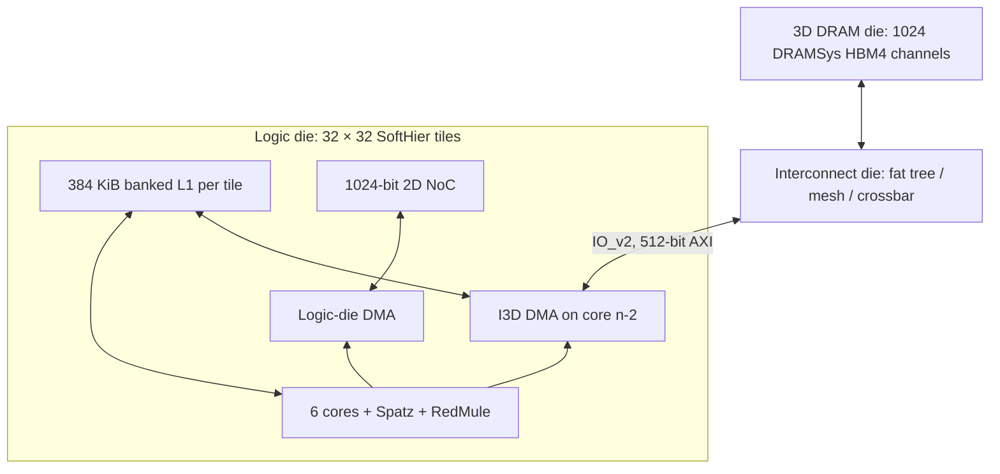

# arche3d

`arche3d` combines the SoftHier logic tile with an I3D interconnect die and a
distributed DRAM die. The initial architecture supports **32 × 32 clusters**.
Each cluster has six Snitch cores, four Spatz vector units, RedMule, banked L1,
the existing logic-die DMA, and a dedicated I3D DMA on **core 4 (`n-2`)**.
Core 5 (`n-1`) is the SDK's designated logic-die DMA core.

The logic-die models are an independent source copy in [`logic/`](logic/README.md).
The tile, core extensions, DMA frontend/middle-end, memory, accelerators, and
2D NoCs all resolve within `pulp.chips.arche3d.logic`. Generated register headers
and ISA decoders also use arche3d-specific paths/names. Changes to
`soft_hier_old` therefore do not change arche3d's logic models. Shared GVSoC
framework/ISS services and the `pulp/3d_network` interconnect remain normal
module dependencies.



## Build and run

Run these commands from the top-level `gvsoc` directory. Use the `chi/3darch`
branch and initialize the SDK along with the model submodules:

```bash
git submodule update --init engine core pulp gvrun config_tree gvtest pulpos arche3d_sdk

python3.12 -m venv build/venv
source build/venv/bin/activate
python -m pip install -r core/requirements.txt -r gapy/requirements.txt \
    -r gvrun/requirements.txt 'cmake>=3.28,<4'
source sourceme_systemc.sh
export USE_GVRUN=1 USE_GVRUN2=1

make dramsys_preparation
make cfg=default TARGETS='arche3d' build
make cfg=default app=alltoall arche3d-sw

gvrun --target=arche3d --parameter=config=default \
    --binary=build/arche3d/sw/default/alltoall/alltoall.elf \
    --work-dir=build/runs/arche3d_alltoall run
```

Software compilation requires a RISC-V bare-metal GCC supporting RV32IMAFD and
Zicsr. Put its `bin` directory on `PATH`. The default prefix is
`riscv64-unknown-elf-`; an RV32-capable RV64 toolchain can compile the 32-bit
application. Override with `CROSS_COMPILE=/path/to/bin/riscv32-unknown-elf-` if
needed. XDMA instructions use GNU `.insn`, so no custom assembler is required.

`make cfg=default app=alltoall arche3d-run` is shorthand for the `gvrun` command.
The target prints `ARCHE3D_PROGRESS` every 10,000 cycles and ends with one
`ARCHE3D_RESULT`. `--parameter=progress_cycles=0` disables periodic progress.
Generating and loading the complete 6,144-core system also takes host time
before the first simulated cycle; this interval has no progress counter.

## Configuration

[`configs/default.py`](configs/default.py) contains the architecture parameters.
Both the hardware target and SDK read this **same file**. No configuration is
copied over tracked source files. `cfg` accepts `default` or a Python file
defining `FlexClusterArch`:

```bash
make cfg=/absolute/path/my_arch.py TARGETS=arche3d build
make cfg=/absolute/path/my_arch.py app=alltoall arche3d-sw
gvrun --target=arche3d --parameter=config=/absolute/path/my_arch.py \
    --binary=build/arche3d/sw/my_arch/alltoall/alltoall.elf \
    --work-dir=build/runs/my_arch_alltoall run
```

Rebuild hardware and software when the architecture changes. `i3d_fabric`
accepts `fattree`, `mesh`, or `xbar`. Fat-tree routing accepts `NCA_HASH` or
`adaptive nca`. The default is level-3 fat tree with Adaptive NCA, eight source
contexts, eight memory contexts, AXI address/data/ID/LEN widths 64/512/10/8,
and at most 256 beats per burst. All dies run at 1 GHz.

Each DRAM endpoint uses `hbm4-emu-fast.json` through the existing GVSoC DRAMSys
configuration convention. There is no extra memory-read-slot limit: DRAMSys
supplies memory timing and request capacity. `dram3d_node_space` is the exposed
address space per channel, not the physical capacity of the DRAMSys memspec.

## Memory and numbering

| Region | Address | Scope |
| --- | --- | --- |
| L1 | `0x00000000`, 384 KiB | Local to each cluster |
| Stack | `0x10000000`, 128 KiB | Private stack slice per core |
| Zero memory | `0x18000000`, 128 KiB | Logic-die DMA |
| Cluster registers | `0x20000000`, 512 B | SoftHier tile |
| Remote L1 | `0x30000000 + cluster_id * 0x60000` | Logic-die DMA / data NoC |
| Synchronization | `0x40000000 + cluster_id * 0xc0` | Separate synchronization NoC |
| Instructions | `0x80000000`, 64 KiB | ELF replicated into each tile |
| System registers | `0x90000000`, 64 KiB | Runtime control |
| 3D DRAM | `0x100000000`, 32 MiB total | I3D DMA, 32 KiB per channel |

Cluster IDs retain SoftHier's `y * num_cluster_x + x` numbering. I3D terminals
use `x * num_cluster_y + y`. The SDK provides both IDs and
`arche3d_dram_address(terminal, local_offset)`, which applies the configured
interleaving. 64-bit DMA addresses reach DRAM above the RV32 scalar address
space. Remote L1 and synchronization ranges overlap numerically in the supplied
32 × 32 map but use separate physical paths; a scalar synchronization access
does not select the data NoC.

## DMA contract

The new DMA uses the local copies of the XDMA frontend and sparse/2D middle-end. A separate
backend tracks each row, burst, buffer, and L1 completion. Its external port is
`IoV2SingleReq`; IO_v1 remains inside the existing logic tile. The two protocols
have different C++ request types, so two components exchange an owned descriptor
through private wires at the boundary.

Every live burst has a distinct AXI ID. IDs and buffers are retained until its
response and L1 work complete. IO_v2 denied requests retry synchronously when
the interconnect signals readiness. TCDM and AXI annotated latencies are honored.
Transfers split at AXI's 4-KiB boundary, the configured maximum burst length, and
the memory interleaving boundary. A 1-KiB aligned B16 transfer stays one burst.
Byte-unaligned transfers remain byte-accurate; there is no alignment padding
that overwrites adjacent L1 or DRAM data.

The I3D DMA supports L1↔DRAM 1D/2D copies and sparse gathers. Packed unsigned
8/16/32/64-bit indices reside in L1, start on an 8-byte boundary, and use a
power-of-two source stride. Descriptor settings are snapshotted at launch;
completion IDs retire in descriptor order even if bursts return out of order.
Collective operations are rejected with a fatal diagnostic before entering I3D.
The logic-die DMA retains its existing collective capability and interfaces.
Its inherited collective row/column masks remain 16 bits; extending those masks
to cover a full 32 × 32 collective is outside this initial I3D integration.

## Software and benchmark

The separate `arche3d_sdk` submodule contains a new bare-metal runtime, startup,
generated linker map, DMA API, and applications. Its runtime initializes BSS,
assigns stacks, synchronizes local cores, reports traps and exit status, and
waits for every cluster to finish. The system-register barrier is a control
facility outside the measured data path; it does not model synchronization NoC
contention. The existing synchronization NoC remains connected for applications
that need to measure it.

`alltoall` runs on the I3D DMA core in every cluster. Source terminal `s` reads
one 16-beat burst from each endpoint `(s+k) mod 1024`. Two queued 2D descriptors
cover the rotation and wrap, with zero destination stride to reuse an L1 buffer.
The run transfers 1,048,576 bursts / 1 GiB. The control model checks every
destination, burst size, completion, and live ID. For byte-by-byte response
checking, add `--parameter=memory_init=pattern`; this enables the same initial
pattern as `network3d_hbm4` and a passive DMA data checker.

`network_cycles` measures first AXI acceptance to last AXI response, with the
benchmark's half-cycle convention. `software_cycles` includes descriptor issue,
L1 drain, polling and completion reporting after the global start barrier.
`total_cycles` also includes boot. `wall_seconds` is the simulation interval;
use `/usr/bin/time` around `gvrun` to include Python elaboration and model loading.
The earlier 45,544.5-cycle result is a comparison point, not a programmed delay
or a pass threshold. See [validation.md](doc/validation.md) for measurements.

The `smoke` application checks DRAM writes/reads, sparse gathers at all four
index widths, and byte-unaligned page-crossing reads. `reject_collective` is an
expected-failure test. Build these by changing `app=` and select their ELFs with
`--binary`. Run `smoke` with the default memory initialization because it writes
its own data.

`queue` stresses descriptor/burst backpressure, reuses AXI IDs over 512 reads,
and checks that a following empty gather waits for older transfers. The
[one-tile fixture](../../../tests/arche3d/README.md) runs these functional tests
without constructing the full chip.
