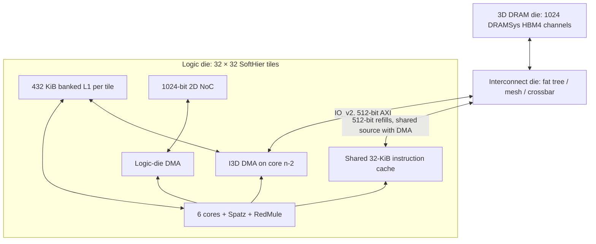

# arche3d

`arche3d` combines the SoftHier logic tile with an I3D interconnect die and a
distributed DRAM die. The initial architecture supports **32 × 32 clusters**.
Each cluster has six Snitch cores, four Spatz vector units, RedMule, banked L1,
the existing logic-die DMA, and a dedicated I3D DMA on **core 4 (`n-2`)**.
Core 5 (`n-1`) is the SDK's designated logic-die DMA core.

The logic-die models are an independent source copy in [`logic/`](logic/README.md).
The tile, core extensions, DMA frontend/middle-end, memory, accelerators, and
2D NoCs all resolve within `pulp.chips.arche3d.logic`. Generated register headers
and ISA decoders also use arche3d-specific paths/names. Changes to
`soft_hier_old` therefore do not change arche3d's logic models. Shared GVSoC
framework/ISS services and the `pulp/3d_network` interconnect remain normal
module dependencies.



## Build and run

Run these commands from the top-level `gvsoc` directory. Use the `chi/3darch`
branch and initialize the SDK along with the model submodules:

```bash
git submodule update --init engine core pulp gvrun config_tree gvtest pulpos arche3d_sdk

python3.12 -m venv build/venv
source build/venv/bin/activate
python -m pip install -r core/requirements.txt -r gapy/requirements.txt \
    -r gvrun/requirements.txt 'cmake>=3.28,<4'
source sourceme_systemc.sh
export USE_GVRUN=1 USE_GVRUN2=1

make dramsys_preparation
make cfg=default TARGETS='arche3d' build
make cfg=default app=alltoall arche3d-sw

gvrun --target=arche3d --parameter=config=default \
    --binary=build/arche3d/sw/default/alltoall/alltoall.elf \
    --work-dir=build/runs/arche3d_alltoall run
```

Software compilation requires a RISC-V bare-metal GCC supporting RV32IMAFD and
Zicsr. Put its `bin` directory on `PATH`. The default prefix is
`riscv64-unknown-elf-`; an RV32-capable RV64 toolchain can compile the 32-bit
application. Override with `CROSS_COMPILE=/path/to/bin/riscv32-unknown-elf-` if
needed. XDMA instructions use GNU `.insn`, so no custom assembler is required.

`make cfg=default app=alltoall arche3d-run` is shorthand for the `gvrun` command.
The target prints `ARCHE3D_PROGRESS` every 10,000 cycles and ends with one
`ARCHE3D_RESULT`. `--parameter=progress_cycles=0` disables periodic progress.
Generating and loading the complete 6,144-core system also takes host time
before the first simulated cycle; this interval has no progress counter.

## Configuration

[`configs/default.py`](configs/default.py) contains the architecture parameters.
Both the hardware target and SDK read this **same file**. No configuration is
copied over tracked source files. `cfg` accepts `default` or a Python file
defining `FlexClusterArch`:

```bash
make cfg=/absolute/path/my_arch.py TARGETS=arche3d build
make cfg=/absolute/path/my_arch.py app=alltoall arche3d-sw
gvrun --target=arche3d --parameter=config=/absolute/path/my_arch.py \
    --binary=build/arche3d/sw/my_arch/alltoall/alltoall.elf \
    --work-dir=build/runs/my_arch_alltoall run
```

Rebuild hardware and software when the architecture changes. `i3d_fabric`
accepts `fattree`, `mesh`, or `xbar`. Fat-tree routing accepts `NCA_HASH` or
`adaptive nca`. The default is level-3 fat tree with Adaptive NCA, eight source
contexts, eight memory contexts, AXI address/data/ID/LEN widths 64/512/10/8,
and at most 256 beats per burst. All dies run at 1 GHz.

The default cluster has 432 KiB of TCDM and a 16 × 32 RedMule array. TCDM bank
timing prioritizes DMA over RedMule and other HWPE accesses, then core/vector
accesses. All paths still access the same physical banks.

By default, `dram3d_backend='dramsys'` selects `pulp.3d_network.dramsys_endpoint`.
Each endpoint uses `hbm4-emu-fast.json` through the existing GVSoC DRAMSys
configuration convention. There is no extra memory-read-slot limit: DRAMSys
supplies memory timing and request capacity. `dram3d_vault_space` is the exposed
address space per vault, modeled by one DRAMSys channel. It defaults to
`0x8000000` (128 MiB); `dram3d_vault_interleave` defaults to `0x8000`
(32 KiB). This exposed space is separate from the DRAMSys memspec capacity.

### Built-in RAM endpoints

Set `dram3d_backend='memory'` to use `pulp.3d_network.memory_endpoint.MemoryEndpoint`
on every I3D memory port. `dram3d_ram_slots` controls concurrent read bursts
per RAM endpoint (default 4), independently of `i3d_memory_contexts` in the NoC.
It is ignored by DRAMSys; `dram3d_type` is ignored by the RAM backend.

Set these fields in your configuration's `FlexClusterArch`, for example in
[`configs/default.py`](configs/default.py):

```python
self.dram3d_backend = 'memory'
self.dram3d_ram_slots = 8
```

After setting up the Python environment and RISC-V compiler, use the ordinary
GVSoC environment (`sourceme.sh`) without `SYSTEMC_HOME` set. RAM mode needs
neither DRAMSys preparation nor SystemC. These commands assume the fields above
have been set in `configs/default.py`:

```bash
source sourceme.sh
export USE_GVRUN=1 USE_GVRUN2=1
make cfg=default TARGETS=arche3d build
make cfg=default app=smoke arche3d-sw
gvrun --target=arche3d --parameter=config=default \
    --binary=build/arche3d/sw/default/smoke/smoke.elf \
    --work-dir=build/runs/arche3d_ram_smoke run
```

Both backends use the same address map, capacity, interleaving, I3D interface,
ELF/prepared-input loading, and cache initialization. RAM storage allocates host
pages on writes/preloads; untouched bytes return zero or the selected benchmark
pattern. Thus the default 128-GiB map does not allocate 128 GiB of host RAM.
File fragments and zero-fill are applied at time zero, including in pattern mode.
The endpoint retains its `axi_sim_mem` beat service, backpressure, and read-slot
timing. It does not model DRAM row buffers, refresh, or controller scheduling,
so its timing results are not HBM4/DRAMSys measurements.

## Memory and numbering

| Region | Address | Scope |
| --- | --- | --- |
| L1 | `0x00000000`, 432 KiB | Data and all core stacks, shared within each cluster |
| Stacks within L1 | `0x00066000`–`0x0006bfff`, 24 KiB | Six downward-growing stacks, 4 KiB per core |
| Zero memory | `0x18000000`, 128 KiB | Logic-die DMA |
| Cluster registers | `0x20000000`, 512 B | SoftHier tile |
| Remote L1 | `0x30000000 + cluster_id * 0x6c000` | Core loads/stores via sync NoC; logic DMA via data NoC |
| Wakeup command | `0x50000000`, 4 B | Multicast notification over the sync NoC |
| Program alias | `0x80000000`, 32 MiB | RV32 read/execute alias, shared 32-KiB cache per cluster |
| System registers | `0x90000000`, 64 KiB | Runtime control |
| 3D DRAM | `0x100000000`, 128 GiB total | 128 MiB per vault, 32-KiB interleaving |
| Shared program in DRAM | `0x100000000`–`0x101ffffff` | First stripe, one ELF image for the system |
| Application DRAM | `0x102000000`–`0x20ffffffff` | All stripes after the program; 128 MiB minus 32 KiB per vault |

There is no separate stack memory or mapping at `0x10000000`. The default
`cluster_stack_size` reserves `num_core_per_cluster * 4096` bytes at the top
of TCDM; `cluster_stack_base` is the start of that reservation. Each core gets
an equal, 16-byte-aligned slice. Core 0 starts with SP `0x6c000`, core 1 with
`0x6b000`, through core 5 with `0x67000`. Stacks use the same banked L1 ports
as ordinary data and contend with other L1 users. The linker confines data,
BSS, and the available heap to the region below `0x66000`, reserving the first
64 bytes as before. Oversized data/BSS fails at link time. Rebuild software
after changing this layout; binaries built for the old stack map will not run.

There is **no separate synchronization memory**. The remote L1 alias accesses
exactly the same banks as local loads/stores, including application data and
stacks. Scalar accesses take the 32-bit synchronization NoC; the logic-die DMA
continues using the 1024-bit data NoC. The SDK provides
`arche3d_remote_l1_address(cluster_id, local_address)` to translate an L1 pointer.
For example, core loads/stores through a volatile pointer to that address can
exchange data with another cluster without using either DMA. Remote word
atomics also use the synchronization path.

The full remote-L1 range is `0x30000000`–`0x4affffff`, so the special wakeup
address is **`sync_wakeup_addr=0x50000000`**, outside that range. There are no
per-cluster sync-memory windows and no `sync_interleave`/`sync_special_mem`
parameters. A write to the wakeup command multicasts one notification to the
Cartesian product of the programmed 32-bit X/Y masks: bit `x` selects column
`x`, and bit `y` selects row `y`. The command completes after delivery to all
selected clusters. An empty mask sends nothing; bits outside the grid are
ignored.

The SDK provides `arche3d_wakeup(x_mask, y_mask)` and
`arche3d_wakeup_wait()`. One designated core per cluster waits with a blocking
MMIO access, then can use the local core barrier to release its peers. This is
a cluster notification, not a core interrupt. Notifications arriving before a
wait are counted and consumed one at a time. The mask registers are shared
within a cluster; serialize programming if more than one core sends wakeups.
Wakeups and remote L1 traffic contend on the same modeled sync NoC.

| Cluster-register offset | Access | Purpose |
| --- | --- | --- |
| `0x20` | Write | Consume one wakeup; block if none is pending |
| `0x24` | Read/write | Destination X bitmap |
| `0x28` | Read/write | Destination Y bitmap |
| `0x2c` | Read | Pending notification count |
| `0x30` | Read | Total received notifications (32-bit counter) |

Cluster IDs retain SoftHier's `y * num_cluster_x + x` numbering. I3D terminals
use `x * num_cluster_y + y`. The SDK provides both IDs and
`arche3d_dram_address(terminal, local_offset)`, which applies the configured
interleaving. 64-bit DMA addresses reach DRAM above the RV32 scalar address
space. The scalar remote-L1 range and wakeup command do not overlap.

## Scalar and vector floating-point formats

Each core's existing `fmode` CSR at **`0x800`** also controls its attached Spatz.
The register resets to 0; other cores have independent format state.

| `fmode` | Scalar / vector FP16 | Scalar / vector FP8 |
| --- | --- | --- |
| 0 | IEEE half, E5M10 | E5M2 |
| 3 | BF16, E8M7 | E4M3 |

Vector instruction encodings and SEW remain unchanged. At SEW=16, `vfadd.vv`
performs FP16 or BF16 addition; at SEW=8 it performs E5M2 or E4M3 addition.
FP32/FP64, integer operations, and raw register/load/store bit layouts keep
their existing behavior. Widening/narrowing chooses the active format at both
operand widths. E4M3 uses the scalar model's IEEE-like infinity/NaN encoding
(maximum finite magnitude 240), rather than the finite-only E4M3FN encoding.

Writing `fmode` waits for queued vector work to finish before changing formats.
It preserves vector-register contents, VL and VTYPE, takes effect without
another `vsetvli`, and persists across later SEW changes. The SDK exposes this
as `arche3d_fp_format_set()` and `arche3d_fp_format_get()`.

The CSR handling stays in arche3d's local core model. The shared RVV helper's
`CONFIG_GVSOC_ISS_VECTOR_FMODE` opt-in is enabled only for arche3d Spatz cores;
other targets retain their existing format mapping. See the
[software fixture](../../../tests/arche3d/README.md#floating-point-format-regression)
for the executable regression.

Both scalar and vector cores support **exp, sin, cos, sqrt and reciprocal**
in all four narrow formats. The new functions use arche3d custom instructions
and SDK helpers; existing sqrt and legacy vector-exp encodings are retained.
See [special functions](doc/special_functions.md) for APIs, encodings,
rounding/exception behavior, timing assumptions and regression commands.

## Instruction cache and boot

Each cluster has one **32-KiB shared instruction cache**, reusing the existing
PULP Snitch cache implementation in [`logic/icache.cpp`](logic/icache.cpp).
The local adaptation reads ordinary GVSoC properties, so it also works when
runtime parameters cause GVSoC to use its JSON configuration path. It also
permits hits while another line is refilling, with immediate victim
invalidation to protect in-flight data. The shared Snitch model and GVSoC
framework are unchanged. The defaults are direct mapped, 64-byte lines,
one outstanding refill, and one independent **256-bit fetch
port per core**. The ISS fetches 32-byte blocks; a cache hit transfers that block
in one cycle without competing with the other cores' fetch ports, and resident
hits remain available during unrelated refills. Cache misses
use the same **512-bit IO_v2 I3D source** as the dedicated DMA. The source
adapter arbitrates requests and assigns distinct AXI IDs across both clients.
The cache is instruction/read-only; it also serves program constants and the
initial data image. It is not an L1 data cache.

RV32 cores cannot use `0x100000000` as their PC. `instruction_base=0x80000000`
is an executable alias: cache refills translate it to `dram3d_start_base`.
There is no instruction-memory component behind this alias. The first stripe
across all vaults is reserved for one shared program image. Each 128-MiB
vault leaves 128 MiB minus 32 KiB for application data in the remaining stripes.
Use `arche3d_dram_data_address(terminal, offset)` for this storage;
`arche3d_dram_address` remains the raw physical-address helper.

Boot proceeds as follows:

1. The simulator directly populates the HBM channels' backing memory from the
   ELF, splitting its segments according to the normal DRAM interleaving.
   Optional `.arche3d.dram` records contain prepared inputs at 64-bit physical
   addresses. This takes zero simulated cycles and issues no timed requests.
2. At reset release, one ELF snapshot is broadcast directly to
   every cache. The model copies data, valid tags and line state for the
   entry-containing window, up to 32 KiB. This preheating takes **zero simulated
   cycles** and issues no I3D/DRAMSys requests. It models an already warm cache;
   it does not model the hardware cost of warming it.
3. After memory and caches are initialized, the system releases all cores
   together. `ARCHE3D_BOOT` reports `image_load_mode: direct`,
   `image_loaded_cycle: 0`, `dram_preloaded_bytes`, `preheat_mode: direct`,
   `preheat_cycles: 0`, and the release cycle. The program stays in DRAM so
   ordinary misses can fetch it later through the timed path.
4. Cluster core 0 copies initialized data from the shared image into local L1,
   clears local BSS, and releases its peers through the local barrier. Each
   core retains its 4-KiB L1 stack and calls `main()`.

Programs larger than the preheated window use demand refills during execution.
Direct DRAM population leaves row buffers and controller timing in their
initial state. Direct population is the only ELF-loading path; no clocked
system loader or loader-only I3D port is instantiated. Software tensor generation
still costs cycles unless the application uses prepared inputs. The
[SDK example](../../../../arche3d_sdk/kernelbench/DSA/dsa_sparse_attention_h16_ckv512_kpe64/doc/README.md)
documents ELF-prepared inputs and the one-query and 1024-query benchmarks.

Core `fence.i` signals invalidate the shared cache. No code/data coherence is
provided for DMA writes to executable memory; keep application buffers in the
second stripe. `icache_size`, `icache_line_size`, and `icache_core_width` are
hardware configuration parameters. The obsolete `instruction_mem_base` and
`instruction_mem_size` fields have been removed. **Rebuild existing ELFs**:
the ELF reader rejects the old per-cluster L1 load-segment layout.

`ARCHE3D_RESULT` separates `boot_cycles`, total simulation cycles, and the
existing DMA benchmark interval. `icache_preloaded_lines` counts lines copied
directly across all clusters; these are excluded from `icache_refills` and
`icache_runtime_refills`. A program that fits in the preheated
window should have zero runtime refills unless it invalidates the cache.
These instruction timings are a configured GVSoC model, not an RTL-calibrated
cache implementation.

## DMA contract

The new DMA uses the local copies of the XDMA frontend and sparse/2D middle-end. A separate
backend tracks each row, burst, buffer, and L1 completion. Its external port is
`IoV2SingleReq`; IO_v1 remains inside the existing logic tile. The two protocols
have different C++ request types, so two components exchange an owned descriptor
through private wires at the boundary.

Every live burst has a distinct AXI ID. IDs and buffers are retained until its
response and L1 work complete. IO_v2 denied requests retry synchronously when
the interconnect signals readiness. TCDM and AXI annotated latencies are honored.
Transfers split at AXI's 4-KiB boundary, the configured maximum burst length, and
the memory interleaving boundary. A 1-KiB aligned B16 transfer stays one burst.
Byte-unaligned transfers remain byte-accurate; there is no alignment padding
that overwrites adjacent L1 or DRAM data.

The I3D DMA supports L1↔DRAM 1D/2D copies and sparse gathers. Packed unsigned
8/16/32/64-bit indices reside in L1, start on an 8-byte boundary, and use a
power-of-two source stride. Descriptor settings are snapshotted at launch;
completion IDs retire in descriptor order even if bursts return out of order.
Collective operations are rejected with a fatal diagnostic before entering I3D.
The logic-die DMA retains its existing collective capability and interfaces.
Its inherited DMA collective row/column masks remain 16 bits. The separate
sync-NoC wakeup multicast uses 32-bit destination bitmaps for the full grid.

## Shared floating-point arithmetic

Scalar Snitch, Spatz, RedMule and data-NoC reductions share GVSoC FlexFloat
for FP16, BF16, FP8 E5M2 and FP8 E4M3. The data NoC supports sum/max in each
format with a one-cycle reduction/join stage. RedMule rounds each fused MAC
to an **FP32 accumulator**, retaining its 32-bit state across internal tiles
before converting once to the selected FP16/BF16/FP8 output format.
NoC/RedMule use RNE independently of CPU rounding CSRs.
See [float_math.md](doc/float_math.md) for command encodings, numerical
semantics, SDK APIs and reproducible cross-unit tests.

## Software and benchmark

The separate `arche3d_sdk` submodule contains a new bare-metal runtime, startup,
generated linker map, DMA API, and applications. Its runtime initializes BSS,
assigns stacks, copies local initialized data, synchronizes local cores, reports traps and exit status, and
waits for every cluster to finish. The system-register barrier is a control
facility outside the measured data path; it does not model synchronization NoC
contention. The existing synchronization NoC remains connected for applications
that need to measure remote scalar L1 accesses or multicast wakeups.

`alltoall` runs on the I3D DMA core in every cluster. Source terminal `s` reads
one 16-beat burst from each endpoint `(s+k) mod 1024`. Two queued 2D descriptors
cover the rotation and wrap, with zero destination stride to reuse an L1 buffer.
The run transfers 1,048,576 bursts / 1 GiB. The control model checks every
destination, burst size, completion, and live ID. For byte-by-byte response
checking, add `--parameter=memory_init=pattern`; this enables the same initial
pattern as `network3d_hbm4` and a passive DMA data checker.

`network_cycles` measures the first DMA request accepted by the I3D source
adapter through its last DMA response, with the benchmark's half-cycle convention.
It includes time queued in that adapter. `peak_outstanding` likewise includes
queued DMA requests; it does not count only occupied fabric source contexts.
`software_cycles` includes descriptor issue,
L1 drain, polling and completion reporting after the global start barrier.
`total_cycles` also includes boot. `wall_seconds` is the simulation interval;
use `/usr/bin/time` around `gvrun` to include Python elaboration and model loading.
The earlier 45,544.5-cycle result is a comparison point, not a programmed delay
or a pass threshold. See [validation.md](doc/validation.md) for measurements.

The `smoke` application checks DRAM writes/reads, sparse gathers at all four
index widths, and byte-unaligned page-crossing reads. `reject_collective` is an
expected-failure test. Build these by changing `app=` and select their ELFs with
`--binary`. Run `smoke` with the default memory initialization because it writes
its own data.

`queue` stresses descriptor/burst backpressure, reuses AXI IDs over 512 reads,
and checks that a following empty gather waits for older transfers. The
[small software fixture](../../../tests/arche3d/README.md) runs these functional
tests without constructing the full chip. Its two- or four-tile mode also runs `memory`,
which checks all core stacks, data/BSS initialization, and direct remote L1
loads, stores, and atomics. Its four-tile mode also runs `wakeup` to check
selective multicast, queued notifications, and blocked receivers.
